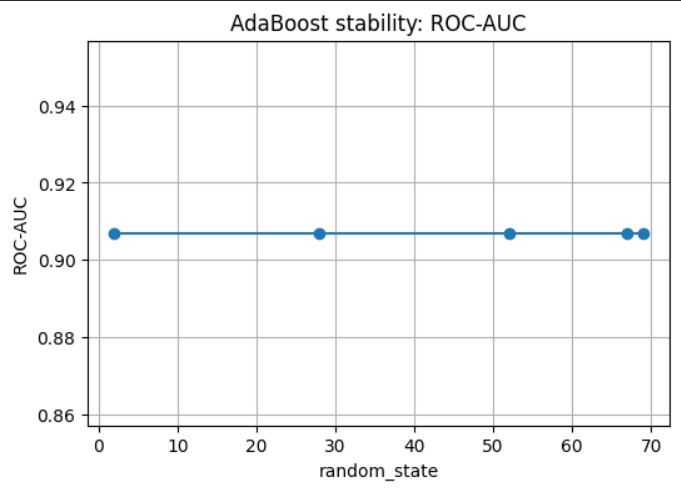
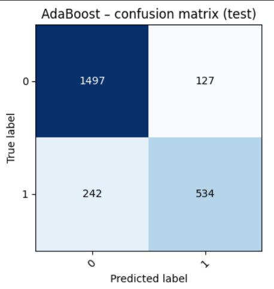
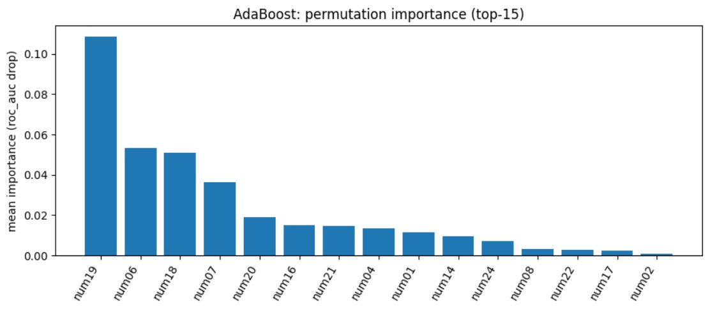

# HW06 – Report

> Файл: `homeworks/HW06/report.md`  
> Важно: не меняйте названия разделов (заголовков). Заполняйте текстом и/или вставляйте результаты.

## 1. Dataset

- Какой датасет выбран: `S06-hw-dataset-01.csv`
- Размер: 12000 30
- Целевая переменная: классы 0 1 доли 67.66 32.34
- Признаки: num cat

## 2. Protocol

- Разбиение: train/test (0.8/0.2, 42)
- Подбор: CV на train (5, ROC-AUC)
- Метрики: 
accuracy - поомгает при сбалансированных классах
F1 - эффективен при дисбалансе классов 
ROC-AUC - отлично показывает себя на бинарной классификации

## 3. Models

Опишите, какие модели сравнивали и какие гиперпараметры подбирали.

Минимум:

- DummyClassifier (baseline), гиперпараметры не подбирались
- LogisticRegression (baseline из S05) гиперпараметры не подбирались
- DecisionTreeClassifier (контроль сложности: `ccp_alpha` 0.000556)
- RandomForestClassifier (контроль сложности: `ccp_alpha` 0.000791)
- Один boosting (AdaBoost, подбирались параметры learning_rare=1 n_estimators=200)

## 4. Results
- AdaBoost (stumps):
Accuracy: 0.8462
F1-score: 0.7432
ROC-AUC:  0.9070

- DecisionTree + CCP pruning (test):
Best ccp_alpha: 0.000556
Accuracy: 0.8821
F1-score: 0.8115
ROC-AUC:  0.9030

- RandomForestClassifier:
Best ccp_alpha: 0.000791
Accuracy: 0.8662
F1-score: 0.7870
ROC-AUC:  0.9007

- Победитель по ROC-AUC AdaBoost
Он лучше глагодаря тому с каждой итерацией дерево исправляет предыдущие ошибки.

## 5. Analysis

- Устойчивость:
была проверена на устойчивость adaboost со значениями random_state 2, 28, 52, 67, 69

как видно эта модель крайне устойчива к этому параметру

- Ошибки: 

FN (242) почти в 2 раза больше, чем FP (127) это говорит что модель слишком осторожная.

- Интерпретация: 

AdaBoost опирается на небольшое число числовых признаков, причём один признак существенно более важен для неего

- выводы:

Среди рассмотренных моделей лучшей по ROC-AUC оказалась AdaBoost.
Модель демонстрирует устойчивые результаты при изменении random_state. Анализ confusion matrix показал, что модель больше склонна пропускает положительный класс, чем выдать ложные срабатывания.
Permutation importance выявил, что качество модели в основном определяется ограниченным набором числовых признаков. Модель показала себя весьма стабильно

## 6. Conclusion

Одиночные деревья легко переобучаются, поэтому контроль сложности (max_depth, min_samples_leaf, ccp_alpha) критичен — без него test-качество быстро деградирует.

Ансамбли (RandomForest, AdaBoost) дают более устойчивые и обобщающие модели, так как усредняют ошибки отдельных деревьев и снижают variance.

Boosting фокусируется на самых информативных признаках, последовательно усиливая их вклад; из-за этого часто появляется небольшое число доминирующих признаков.

ROC-AUC — удобный критерий для сравнения бинарных моделей, так как он оценивает качество ранжирования вероятностей, а не зависит от фиксированного порога.

Честный ML-протокол требует строгого разделения ролей данных:
train — обучение,
CV — подбор гиперпараметров,
test — финальная и единственная оценка качества.